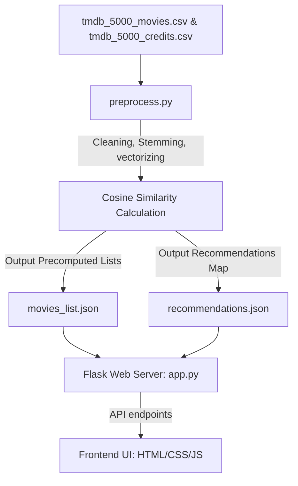

# CineMatch | Content-Based Movie Recommender System

A visually stunning, high-performance web application that recommends movies based on plot, genres, cast, and directors using content-based filtering. The application features a responsive, glassmorphic UI, search autocomplete, TMDB poster fetching with dynamic fallbacks, and is configured for instant Docker and Heroku deployment.

---

## 🚀 Live Demo & Visual Highlights

* **Glassmorphic UI**: Translucent cards, background gradient glow, and micro-interactions on hover.
* **Instant Autocomplete**: Caches titles in the client browser for zero-latency search recommendations.
* **Smart Poster Fetching**: Dynamic integration with the TMDB API, falling back to a custom Canvas-drawn graphics poster if offline or unavailable.
* **Precomputed Recommendation Pipeline**: Offloads cosine similarity calculation from the server runtime, resulting in `< 1ms` query latency and minimal memory footprint.

---

## 🛠️ Architecture & How It Works



### 1. The Preprocessing Engine (`preprocess.py`)
Calculates movie tag similarities offline to optimize hosting constraints (such as Heroku's 500MB slug size and boot timeouts):
* Merges `tmdb_5000_movies.csv` and `tmdb_5000_credits.csv`.
* Extracts and cleans genres, keywords, top 3 actors, and directors.
* Converts textual tags using **Count Vectorization** (`CountVectorizer` with up to 5000 features).
* Computes the **Cosine Similarity** matrix:
$$\text{similarity} = \cos(\theta) = \frac{\mathbf{A} \cdot \mathbf{B}}{\|\mathbf{A}\| \|\mathbf{B}\|}$$
* Generates lightweight JSON records (`movies_list.json` and `recommendations.json`) mapping titles directly to top 8 recommendations.

### 2. The Flask Backend (`app.py`)
A production-ready WSGI application:
* Loads precomputed recommendations in `< 0.2 seconds`.
* Exposes `/api/movies` for autocomplete lists.
* Exposes `/api/recommend?title=<name>` to fetch enriched recommendation objects.

---

## 📂 Project Structure

```
Movie-recommender system/
│
├── static/                  # Static assets
│   ├── css/
│   │   └── style.css        # Premium glassmorphic styling
│   └── js/
│       └── main.js          # Autocomplete search, TMDB poster & Canvas fallback logic
│
├── templates/
│   └── index.html           # Main HTML5 layout
│
├── app.py                   # Flask server entrypoint
├── preprocess.py            # Data pipeline & cosine similarity precalculation script
├── movies_list.json         # Precomputed clean metadata
├── recommendations.json     # Precomputed similarity links
│
├── Dockerfile               # Docker container configurations
├── Procfile                 # Heroku runtime execution declarations
├── requirements.txt         # Lightweight package dependencies (Flask/Gunicorn)
└── runtime.txt              # Locked Python environment (3.11.9)
```

---

## 💻 Local Setup & Execution

### 1. Install Dependencies
Make sure Python is installed, then run:
```bash
pip install Flask gunicorn pandas scikit-learn
```

### 2. Run Preprocessing (Optional)
If you edit the raw CSV datasets, recalculate similarities:
```bash
python preprocess.py
```

### 3. Launch Flask Server
Run the application server locally:
```bash
python app.py
```
Open [http://127.0.0.1:5000](http://127.0.0.1:5000) in your browser.

---

## 🐳 Running with Docker
Ensure Docker Desktop is running, then execute the following commands in the project folder:

1. **Build the image**:
   ```bash
   docker build -t movie-recommender .
   ```
2. **Run the container**:
   ```bash
   docker run -d -p 5000:5000 --name movie-recommender-container movie-recommender
   ```
Open [http://localhost:5000](http://localhost:5000) in your browser.

---

## ☁️ Deploying to Heroku

This repository is optimized for quick, light deployments on Heroku using the Gunicorn production server:

1. Log in to [Heroku Dashboard](https://dashboard.heroku.com/).
2. Create a new app (e.g., `cinematch-recommender`).
3. Under the **Deploy** tab, connect your GitHub repository (`karishmaofficial-eng/Movie--recommender-system`).
4. Click **Deploy Branch** on your `main` branch.
5. Heroku will compile and host the app automatically at your custom URL.
